# moVoice — Architecture Diagrams

> Companion to `arch_essay.md`. All classes and public methods shown. Read together with the essay
> for rationale behind every design choice.

---

## 1 — System Overview (Four Runtimes)

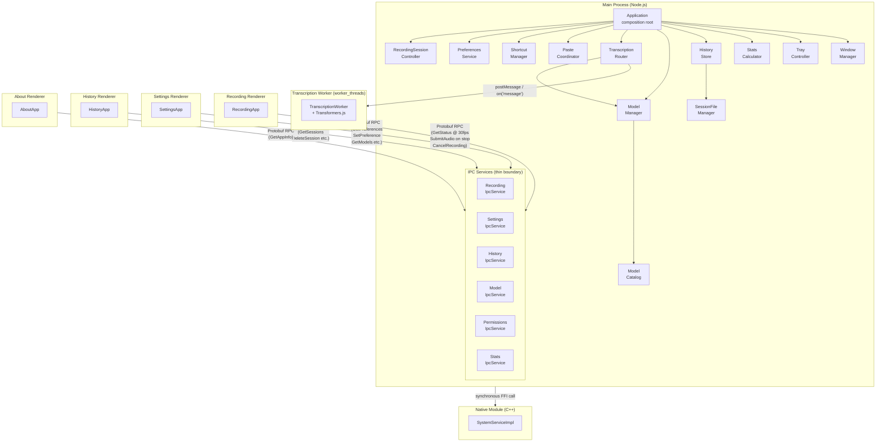

---

## 2 — Recording FSM

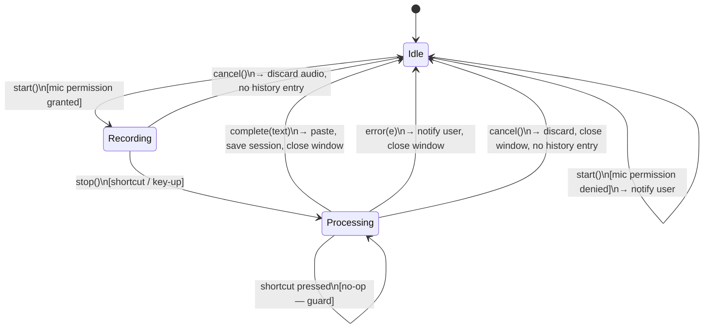

---

## 3 — Main Process: Recording & Transcription Domains

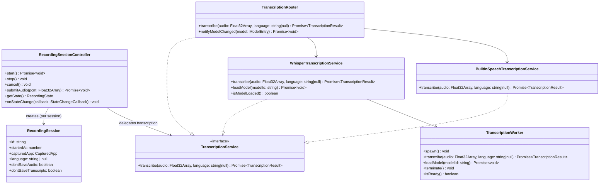

---

## 4 — Main Process: System Integration & Preferences

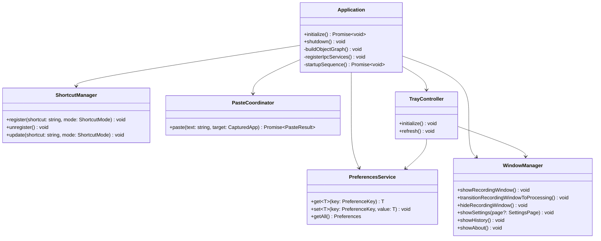

---

## 5 — Main Process: Model Management & Storage

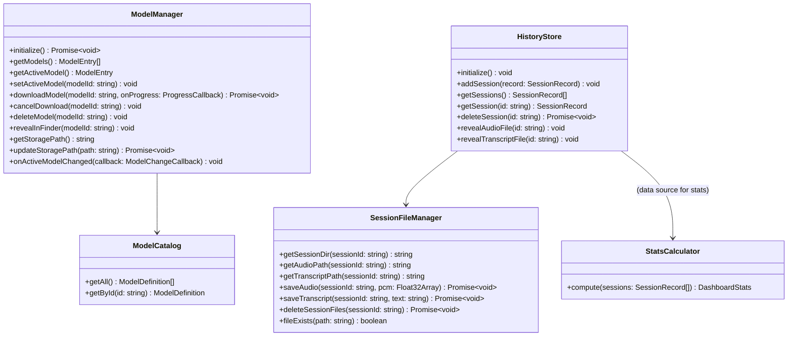

---

## 6 — IPC Services Layer

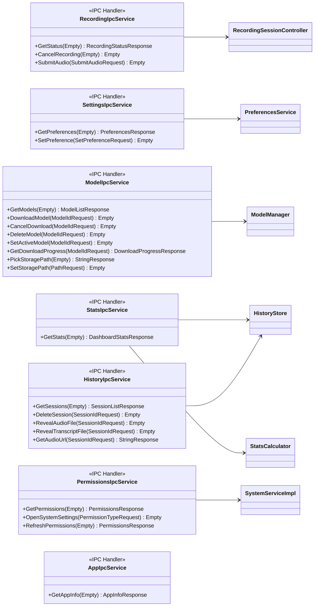

---

## 7 — Native Module

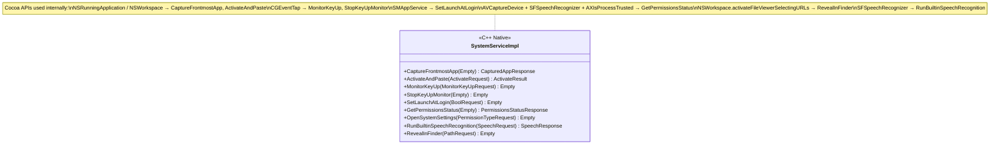

---

## 8 — Renderer: Recording Window

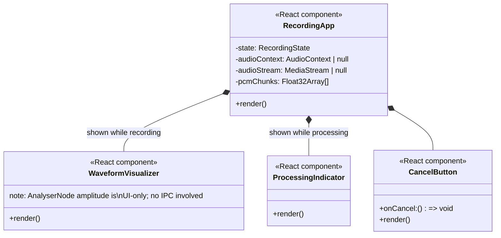

**Audio capture pipeline (renderer-owned, no IPC until submit):**

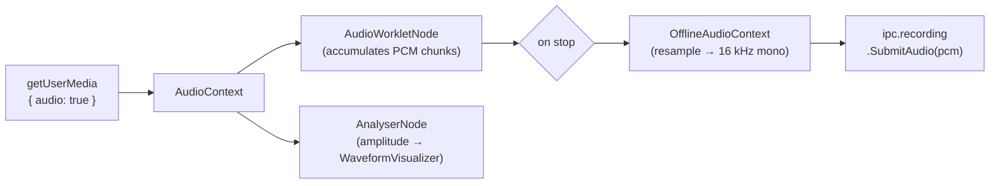

---

## 9 — Renderer: Settings Window

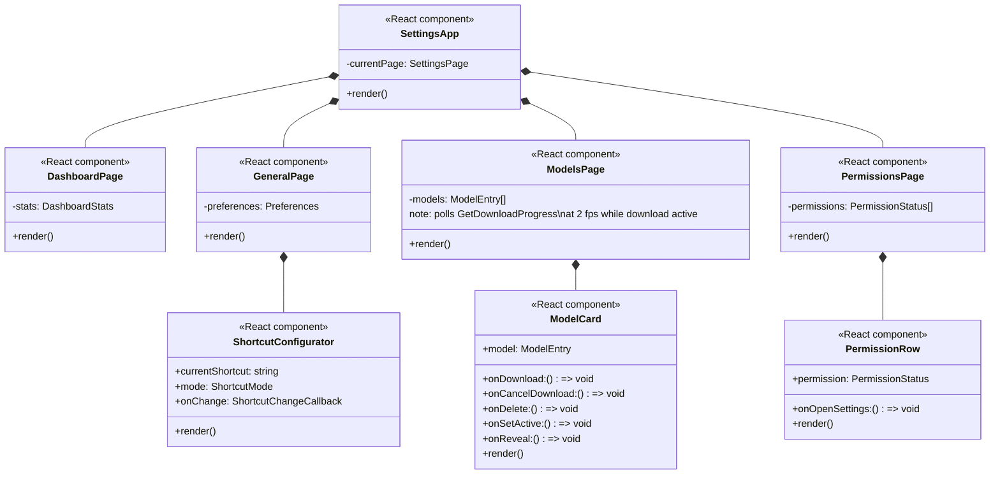

---

## 10 — Renderer: History Window

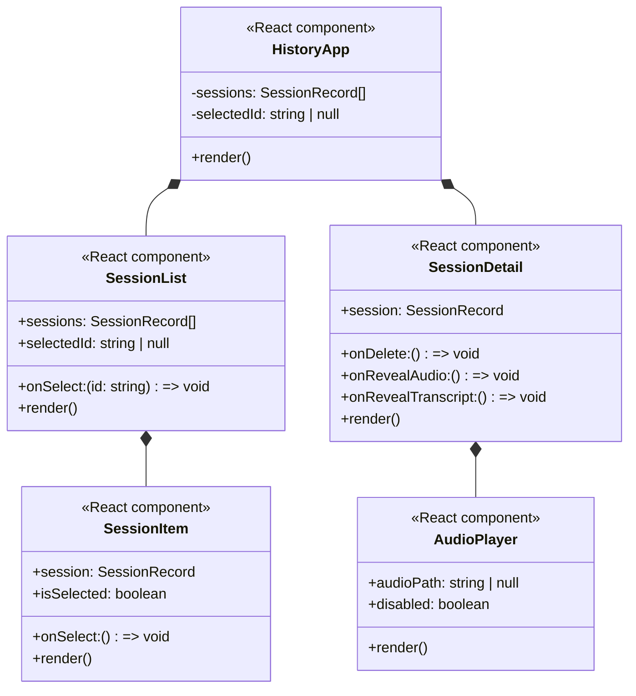

---

## 11 — IPC Communication Map

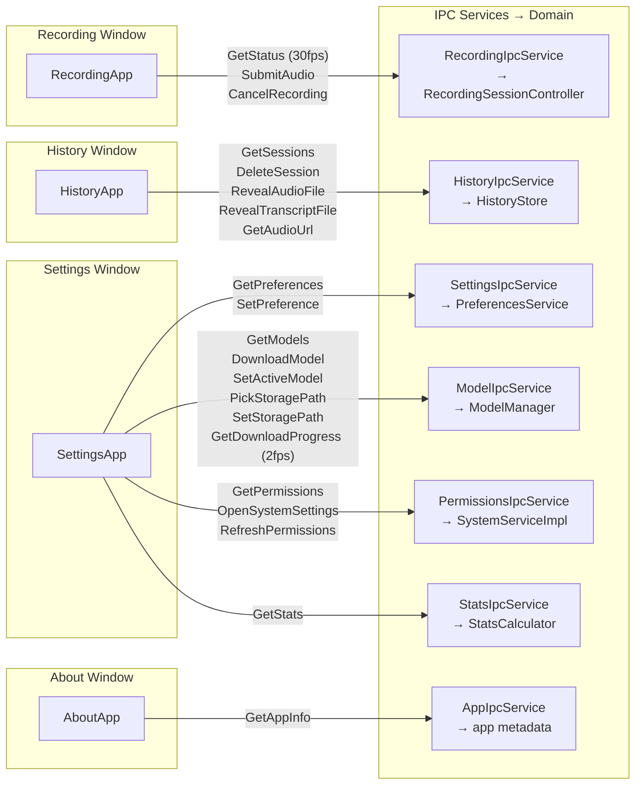

---

## 12 — Full Dependency Graph (Main Process)

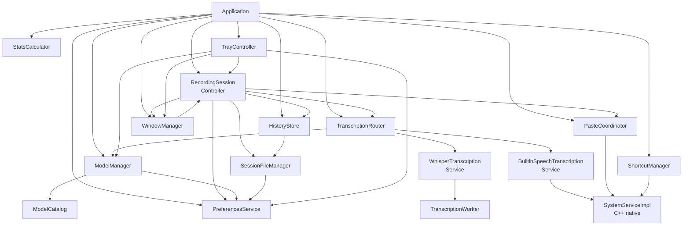
