# moVoice — Architecture Essay

> **Scope.** This document translates the functional inventory and process responsibilities from
> `architecture.md` into a concrete class-level design. Every class named here is a real
> TypeScript class (or React component) that will appear in the codebase. All open questions from
> §6 of `architecture.md` are answered. Alternatives are named and the reasons they were rejected
> are stated. No implementation is provided — only public interfaces and the reasoning behind
> them.

---

## Part I — Design Mandate and Guiding Principles

The highest-priority constraint is **feature completeness** against the specification. The second is
**clean separation of concerns**: business logic must not bleed into IPC handlers, IPC handlers must
not bleed into UI components, and OS integration must be fully encapsulated behind interfaces. The
third is **simplicity**: no abstraction layer exists unless it earns its place.

This means:
- No event bus, no reactive state store in the main process. Components are wired by direct
  dependency injection through the composition root.
- No repository-pattern abstraction over `HistoryStore`. It is the repository.
- No CQRS, no DDD aggregates, no domain events. The application is a desktop tool with one user, not
  a distributed system.
- Three classes that each do one thing clearly are preferable to one class that does three things
  cleverly.

---

## Part II — Resolved Open Questions

This section answers all fourteen open questions from §6 of `architecture.md` before the class
design is presented. The class design follows directly from these answers.

### 2.1 IPC Message Catalog (§6.1)

MōBrowser IPC is request/response only: the renderer initiates an RPC call against the main process.
The main process cannot push unsolicited messages to the renderer.

This constraint drives one architectural decision: **the recording window polls the main process at
30 fps** for the current recording state. A single call `RecordingService.GetStatus()` returns
`{ state: RecordingState }` in one round trip.

Amplitude is **not** in this response. Audio capture lives in the renderer (see §2.15 and Part VI),
so amplitude is computed locally via the Web Audio API `AnalyserNode` — no IPC round trip needed.

The alternative — a streaming Protobuf RPC — was considered but discarded: MōBrowser's IPC
documentation shows only unary RPCs. Adding streaming would require reverse-engineering or extending
the framework, which contradicts the simplicity mandate.

A second alternative — using `BrowserWindow.browser.executeJavaScript()` for main-to-renderer push —
was discarded because this API is not documented in the MōBrowser SDK. Undocumented APIs are not
stable contracts.

Polling at 30 fps is well within browser capabilities. The recording window is the only window that
needs real-time updates, and it is a small, lightweight React app with no other rendering work. IPC
overhead at 30 calls/second is negligible on a local socket.

The complete IPC contract (one proto service per domain) is defined in Part VII.

### 2.2 Recording Session State Machine (§6.2)

The FSM has three states and four transitions:

```
          start()                stop()
  Idle ──────────────► Recording ──────────────► Processing
   ▲                      │                          │
   │                      │ cancel()                 │ complete() / error()
   │                      ▼                          │
   └──────────── (no history entry) ◄────────────────┘
                    (cancel path)
```

| Current State | Event | Guard | Next State | Side Effect |
|---|---|---|---|---|
| `Idle` | shortcut pressed | mic permission granted | `Recording` | open recording window, capture frontmost app, start audio |
| `Idle` | shortcut pressed | mic permission denied | `Idle` | show permission notification |
| `Recording` | shortcut pressed (toggle/combined) | — | `Processing` | stop audio, transition window UI |
| `Recording` | key released (PTT/combined) | — | `Processing` | stop audio, transition window UI |
| `Recording` | cancel() | — | `Idle` | discard audio, close window, no history entry |
| `Processing` | complete(text) | — | `Idle` | paste, save session, close window |
| `Processing` | error(e) | — | `Idle` | notify user, close window |
| `Processing` | cancel() | — | `Idle` | discard, close window, no history entry |
| `Processing` | shortcut pressed | — | `Processing` | no-op (§4.1) |

The authoritative state is owned by `RecordingSessionController` in the main process. The renderer's
recording window polls for it.

### 2.3 Audio File Format (§6.3)

Audio is saved as **WAV** (PCM, 16 kHz, mono, 32-bit float). The native module delivers a
`Float32Array` at 16 kHz; the WAV container wraps it without lossy re-encoding. WAV is the only
format the `<audio>` HTML element plays reliably without a codec, and without a conversion step.

WAV encoding belongs to `SessionFileManager`. It takes the raw `Float32Array`, prepends the standard
44-byte WAV header, and writes the result to disk. This is a pure function over bytes — no library
needed — and it is isolated to one class.

The alternative of saving raw PCM was rejected because it is not browser-playable. The alternative
of encoding to MP3/AAC was rejected because it requires a codec dependency, introduces lossy
compression, and adds complexity with no user benefit for typical voice recording durations.

### 2.4 Language Parameter (§6.4)

Some Whisper models are **multilingual** — they can transcribe in any language, either by
auto-detecting it from the audio or by accepting an explicit language hint that bypasses the
detection pass. Others are **single-language** (e.g. English-only variants like `whisper-tiny.en`)
and ignore any language input entirely. The built-in macOS Speech Recognition is configured per
locale at the OS level; the language hint is passed but its effect depends on the recogniser.

This introduces three language states the system must model:

- **Forced language** — the user has selected a specific BCP-47 language code; it is passed to the
  model as a hint.
- **Auto-detect** — the user has selected "Auto" for a multilingual model; `null` is passed and the
  model determines the language from the audio.
- **Not applicable** — the active model is single-language; the preference has no effect and the
  language picker is visually disabled.

`TranscriptionService.transcribe()` therefore takes `language: string | null`, where `null` means
auto-detect. The return type is `TranscriptionResult` rather than `string`, because multilingual
models report the language they detected — information worth storing in the session record.

The language is resolved from `PreferencesService` at the moment the FSM transitions to
`Processing`, captured into the `RecordingSession` value object (`language: string | null`), and
passed forward from there. Changing the language preference mid-session has no effect on the
in-flight transcription (consistent with §4.12 for the save-audio toggle).

### 2.5 Model Catalog Source (§6.5)

The catalog is a **bundled JSON file** at `resources/models.json`, loaded once at startup by
`ModelCatalog`. It is not updatable without an app release.

The alternative of a remote catalog was rejected: it introduces a network dependency, requires error
handling for offline scenarios, and adds release-management complexity. moVoice is an offline-first
tool. When new models are supported, the user updates the app.

The catalog schema:

```typescript
interface ModelDefinition {
  id: string            // e.g. "openai/whisper-tiny"
  label: string         // e.g. "Whisper Tiny"
  description: string   // one-sentence label shown in UI
  huggingFaceRepo: string
  speedScore: number    // 1.0–5.0
  accuracyScore: number
  fileSizeBytes: number
  isMultilingual: boolean  // false for English-only variants (e.g. whisper-tiny.en)
}
```

The built-in macOS Speech Recognition is represented as a synthetic entry with `id: "builtin"` and
no `huggingFaceRepo`, injected by `ModelManager` at startup rather than read from the JSON file.

### 2.6 Data Schemas (§6.6)

Defined formally in Part VIII.

### 2.7 Startup and Initialisation Sequence (§6.7)

The ordered startup sequence in `Application.initialize()`:

1. **`PreferencesService.load()`** — all subsequent services depend on preferences.
2. **Seed `modelStoragePath`** — if `modelStoragePath` is empty (first run or missing), set it to
   `path.join(app.getPath('userData'), 'models')` and persist. This must happen before
   `LocalModelService.initialize()` reads the path.
3. **`TrayController.initialize()`** — the tray must appear before anything else so the user knows
   the app is running (§5 of `architecture.md`, constraint 5; §4.14).
4. **`dock.hide()`** if `hideDockIcon` preference is set.
5. **`LocalModelService.initialize()`** — reads `modelStoragePath` from preferences, scans disk for
   downloaded models, enforces the no-active-model invariant (§4.6, §4.8).
6. **`ShortcutManager.register()`** — registers the configured global shortcut.
7. **`LocalModelService.warmUp()`** — spawns `TransformersJsWorker` and loads the active model
   eagerly; avoids a cold-start stall on the first recording.
8. **First-run check** — if `app.launchInfo.isFirstRun`, `WindowManager.showSettings()` opens
   directly to the Permissions page.

If any step from 1–6 fails fatally (native module load failure, preferences corruption), the
application shows a native alert via MōBrowser's dialog API and calls `app.quit()`. Steps 7–8 are
non-fatal: a failed warm-up is retried on first use; a missing first-run flag is non-critical.

### 2.8 Error Propagation Model (§6.8)

Every IPC response proto message includes an optional `error` field:

```protobuf
message Error {
  string code = 1;    // machine-readable, e.g. "MIC_PERMISSION_DENIED"
  string message = 2; // human-readable, shown in notifications
}
```

Errors from the native module and from the transcription worker are caught at their call sites in
the main process and translated into `RecordingSessionController.error()` transitions, which drive
the FSM to `Idle`. The recording window then polls and sees the `Idle` state.

For errors that need to surface as notifications (e.g., mic disconnected mid-session), `Application`
provides a `notify(title, body)` helper that calls the MōBrowser `Notification` API.

There is no centralised error service. Each component handles its own domain errors and escalates
via callback or the FSM. The `Error` type carries only a code and a message — no `recoverable`
flag. No renderer in this application has a retry flow; the FSM always returns to `Idle` on error,
and the user simply starts a new recording.

### 2.9 File Storage Layout (§6.9)

```
<userData>/
  history.json          ← HistoryStore metadata (JSON array of SessionRecord)
  sessions/
    <sessionId>/
      audio.wav         ← WAV audio, present only if audio was saved
      transcript.txt    ← plain text transcript, present if transcript was saved
```

Session IDs are UUIDs (version 4) generated at recording start. UUID-based naming is collision-free
and carries no user-identifiable information in the filename. Timestamp-based naming was discarded
because it requires resolving sub-millisecond collisions.

Each session has its own subdirectory. The flat-directory alternative was discarded because it
becomes unwieldy with hundreds of sessions and makes deletion of a single session's files reliable
(remove one directory).

### 2.10 First-Run Permissions Bootstrap (§6.10)

moVoice does **not** proactively request microphone permission at startup. On first run
(`app.launchInfo.isFirstRun`), the Settings window opens automatically on the Permissions page. The
user is shown the permission status and an "Open in System Settings" button for each ungranted
permission.

Microphone permission is checked **just before** starting a recording. If denied at that moment, the
FSM stays in `Idle` and a notification is shown directing the user to Settings → Permissions. This
is less disruptive than a startup permission prompt, which many users dismiss reflexively.

### 2.11 Window Singleton Policy (§6.11)

Settings, History, and About are **singleton windows**. If the window is already open and the user
triggers it again (via tray), the existing window is focused rather than a second instance opened.
Windows are **hidden, not destroyed**, on close. This avoids re-initialising React and losing
transient UI state (e.g., which settings page was open).

The recording window is program-controlled: created once at startup, hidden until needed, shown and
hidden by `RecordingSessionController` state transitions.

About window is the exception: it is lightweight (static content only) and it is acceptable to
destroy and re-create it on each open. This avoids keeping it resident for a window that users
rarely open.

### 2.12 Stats Computation Model (§6.12)

`StatsCalculator` is a **pure function** over `SessionRecord[]`. It does not maintain its own
persistent state. Stats are derived from history records every time the Dashboard page is opened.

- **Time saved** = `totalWords / 40 * 60` seconds. Baseline: 40 WPM average typing speed. This
  constant is a named symbol `BASELINE_TYPING_WPM = 40` in `StatsCalculator`.
- **Keystrokes saved** = `totalWords * 6`. Average word length including trailing space is 6
  keystrokes. Constant: `AVG_WORD_LENGTH_WITH_SPACE = 6`.
- **Words per minute** = `totalWords / (totalAudioDurationSeconds / 60)`, clamped to a sensible
  maximum if audio duration is zero.

### 2.13 Model Switching During Active Transcription (§6.13)

Model switching is **allowed but deferred**: the in-flight transcription completes on the model that
was active when it started (captured in `RecordingSession`). The new model takes effect for the next
session. `TransformersJsWorker` (internal to `LocalModelService`) queues the `loadModel` request
and processes it after the current inference completes.

Blocking the UI while transcription runs to prevent model switching adds complexity for a rare edge
case. The deferred approach is safe and transparent to the user.

### 2.15 Audio Capture in the Renderer Process

Audio capture runs entirely in the **recording window renderer** via the Web Audio API. There is no
native C++ audio code. `AudioServiceImpl` does not exist.

The renderer calls `navigator.mediaDevices.getUserMedia({ audio: true })`. Chromium opens the
system default microphone — no device enumeration, no device picker, no `inputDevice` preference
key. This is a deliberate product decision: moVoice always uses whatever macOS designates as the
default input.

The capture pipeline inside the renderer:
- `MediaStream` from `getUserMedia` feeds an `AudioContext`
- An `AudioWorkletNode` receives raw PCM chunks; the renderer accumulates them into a growing
  `Float32Array`
- An `AnalyserNode` in the same graph provides real-time RMS amplitude for the waveform display
  with no IPC involved
- On stop, an `OfflineAudioContext` resamples the full buffer to 16 kHz mono (Whisper's required
  format)
- The resampled `Float32Array` is sent to the main process via `RecordingService.SubmitAudio()`

Device disconnection during recording is handled by Chromium: if the audio track ends unexpectedly,
the `AudioWorklet` receives no further data and the `MediaStreamTrack.onended` event fires. The
renderer treats this as a recording error — it stops capture, discards the partial buffer, and calls
`RecordingService.CancelRecording()`. No `AVAudioEngineConfigurationChangeNotification` handling is
needed.

Microphone permission is still checked by the main process via `native.permissions.GetPermissionsStatus()`
before showing the recording window (§4.4 corner case). Chromium will additionally prompt the user
at the OS level on first `getUserMedia` call, but the main-process pre-flight prevents the UX of
showing the window and then failing.

### 2.14 Amplitude Throttle Ownership (§6.14)

Not an architectural concern. Waveform animation is a UI detail contained entirely within the
recording window renderer. No IPC, no throttle, no cross-process data.

---

## Part III — The Four Runtimes

```
┌─────────────────────────────────────────────────────────────────┐
│  Main Process (Node.js)                                         │
│                                                                 │
│  Application                                                    │
│  ├── RecordingSessionController ──── FSM, orchestration         │
│  ├── PreferencesService             MōBrowser prefs wrapper     │
│  ├── ShortcutManager                globalShortcut registration │
│  ├── LocalModelService              model state + inference     │
│  │   └── TransformersJsBackend ─── TransformersJsWorker         │
│  ├── WhisperModelCatalog            static model catalog        │
│  ├── TranscriptionRouter            backend selection           │
│  │   └── BuiltinSpeechTranscriptionService                      │
│  ├── PasteCoordinator               clipboard + CGEvent         │
│  ├── HistoryStore + SessionFileManager                          │
│  ├── StatsCalculator                derived dashboard stats     │
│  ├── TrayController                 tray icon + menu            │
│  ├── WindowManager                  window lifecycle            │
│  └── IPC Service Implementations    thin delegators             │
│        (Recording, Settings, History, Model, Permissions, Stats)│
└──────────────────────────┬──────────────────────────────────────┘
                           │  Protobuf RPC (renderer → main)
                           │  Polling at 30 fps (state only)
                           │  SubmitAudio (PCM on stop)
         ┌─────────────────┼──────────────────┐
         ▼                 ▼                  ▼
  ┌──────────────┐  ┌─────────────┐  ┌─────────────┐
  │  Recording   │  │  Settings   │  │   History   │
  │  Renderer    │  │  Renderer   │  │  Renderer   │
  │  (React +    │  │  (React)    │  │  (React)    │
  │  Web Audio)  │  │             │  │             │
  └──────────────┘  └─────────────┘  └─────────────┘

         ┌─────────────────────────────────────────┐
         │  Native Module (C++)                    │
         │  SystemPermissionsServiceImpl           │
         │  PasteServiceImpl                       │
         │  LoginItemServiceImpl                   │
         │  BuiltinSpeechServiceImpl               │
         └─────────────────────────────────────────┘

         ┌─────────────────────────────────────────┐
         │  TransformersJsWorker (worker_threads)  │
         │  Transformers.js pipeline               │
         └─────────────────────────────────────────┘
```

The native module is called synchronously from the main process via the generated TypeScript
bindings. `TransformersJsWorker` communicates with the main process via `postMessage` /
`on('message')`.

---

## Part IV — Main Process Architecture

### 4.1 Composition Root — `Application`

`Application` is the single place where every service is instantiated and wired together. It is not
a service locator; it is a constructor that builds the entire object graph. `src/main/index.ts`
creates one `Application` instance and calls `initialize()`.

No service receives a reference to `Application`. All wiring is done in the constructor via direct
injection. This means any circular dependency is a compile error, not a runtime surprise.

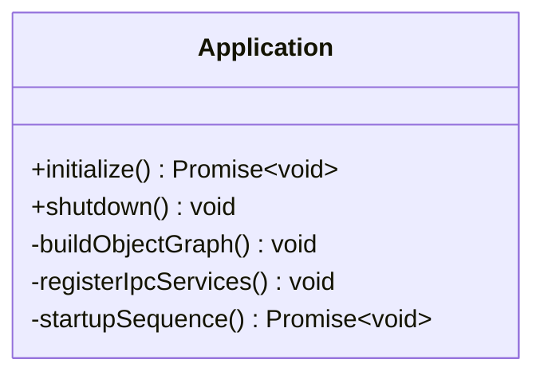

### 4.2 Preferences — `PreferencesService`

A typed wrapper over MōBrowser `prefs`. It eliminates string-key access everywhere else in the
codebase: every preference key is a member of the `PreferenceKey` union type. It encapsulates the
`prefs.persist()` call — callers `set()` a value and `PreferencesService` persists immediately
(write-through).

**Why write-through?** The only risk of unbuffered writes is performance, which is negligible for
preferences (small JSON file, infrequent writes). The risk of _not_ writing through — crashing
before a `persist()` call — is data loss. Write-through eliminates this class of bug.

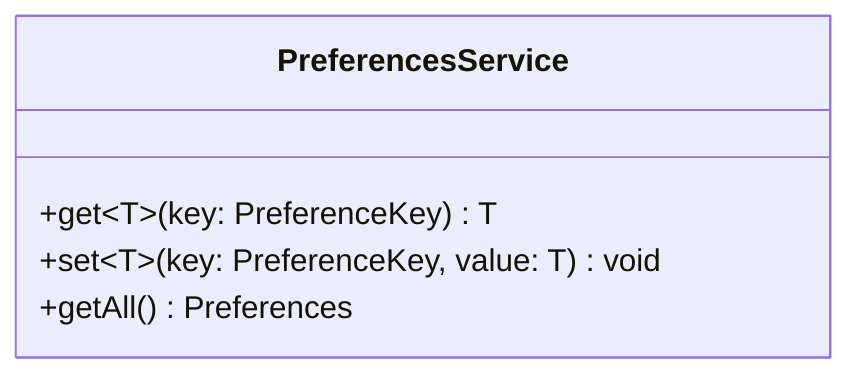

`PreferencesService` has no other public methods. It does not emit change events — the code that
changes a preference knows it changed it.

### 4.3 Recording Domain

This is the heart of moVoice. Two classes: a stateful FSM controller and an ephemeral value object
that captures per-session context.

#### `RecordingSessionController`

The sole owner of the recording FSM. All state transitions happen here, in response to method calls
from its callers. It does not subscribe to events; callers invoke it directly.

The controller coordinates multiple other services but does not own them — they are injected. Its
role is sequencing, not computation.

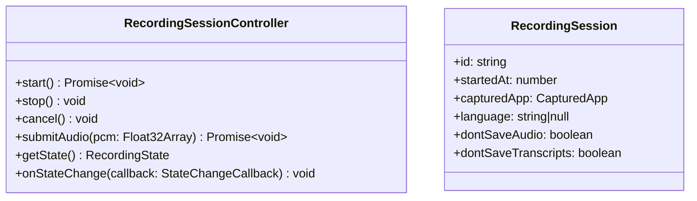

`stop()` is now synchronous — it transitions the FSM to `Processing` and returns immediately. The
controller then waits for the renderer to call `submitAudio()` with the captured PCM before
transcription can begin. `submitAudio()` is the entry point from `RecordingIpcService` after the
renderer has finished encoding its audio buffer.

`getStatus()` is removed — the renderer no longer needs a combined state+amplitude response.
`getState()` is sufficient and polled directly via `RecordingService.GetStatus()` which now returns
only `{ state: RecordingState }`.

`onStateChange()` lets `TrayController` and `WindowManager` react to FSM transitions without
coupling to the controller's internals.

#### Design choice: why not event-driven internally?

An event bus (e.g., `EventEmitter`) where services publish and subscribe to domain events was
considered. Rejected because: the call graph in `RecordingSessionController.start()` is linear and
must be sequential — capture app, start audio, open window — and events add indirection without
reducing coupling. The ordering guarantees become implicit and fragile. Direct method calls are
auditable and testable.

### 4.4 Transcription Domain

#### `TranscriptionService` (interface — moVoice-specific)

```typescript
interface TranscriptionService {
  transcribe(audio: Float32Array, language: string | null): Promise<TranscriptionResult>
}
```

`language: null` means auto-detect; the model resolves the language from the audio itself.
`TranscriptionResult` carries both the text and the language the model actually used (see Part VIII
for the full schema). `RecordingSessionController` holds a reference to `TranscriptionService` and
has no knowledge of which backend is running.

#### `TranscriptionRouter` (moVoice-specific)

The concrete class injected where `TranscriptionService` is needed. Routes to the correct backend
by reading `activeModelId` from `PreferencesService` at call time.

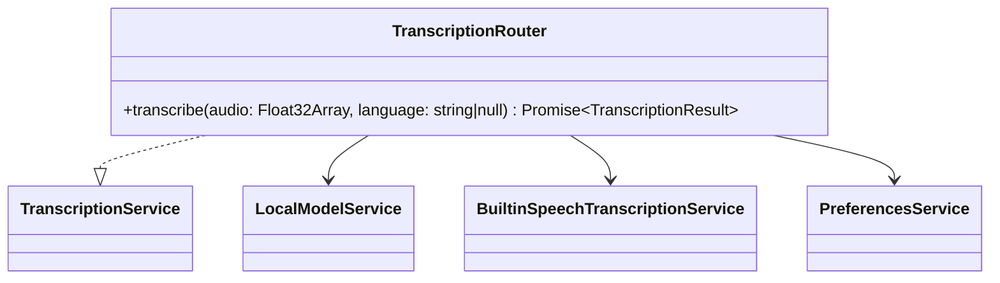

If `activeModelId === 'builtin'` → delegates to `BuiltinSpeechTranscriptionService`.
Otherwise → calls `localModelService.run({ audio, language })`.

`LocalModelService` owns model loading internally — `TranscriptionRouter` does not call
`loadModel()` directly. It simply calls `run()` and trusts the service to have the correct model
warm.

**Why query `PreferencesService` at call time rather than subscribing to changes?**
Same reasoning as before: the active model changes rarely and `transcribe()` is called at most once
per session. Querying is simpler and correct.

#### `BuiltinSpeechTranscriptionService` (moVoice-specific)

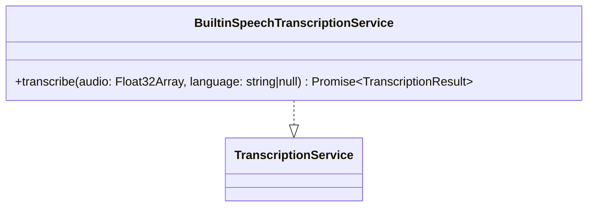

Delegates to `native.speech.RunBuiltinSpeechRecognition()`. No additional logic.

#### `InferenceBackend<TInput, TOutput>` (reusable interface)

```typescript
interface InferenceBackend<TInput, TOutput> {
  load(modelId: string, storagePath: string): Promise<void>
  run(input: TInput): Promise<TOutput>
  unload(): void
  readonly isLoaded: boolean
}
```

The sole abstraction boundary between the reusable `LocalModelService` and any AI runtime.
Transformers.js is one implementation; another app could substitute llama.cpp, CoreML, or any
other backend without touching `LocalModelService`.

#### `TransformersJsBackend` (implementation detail)

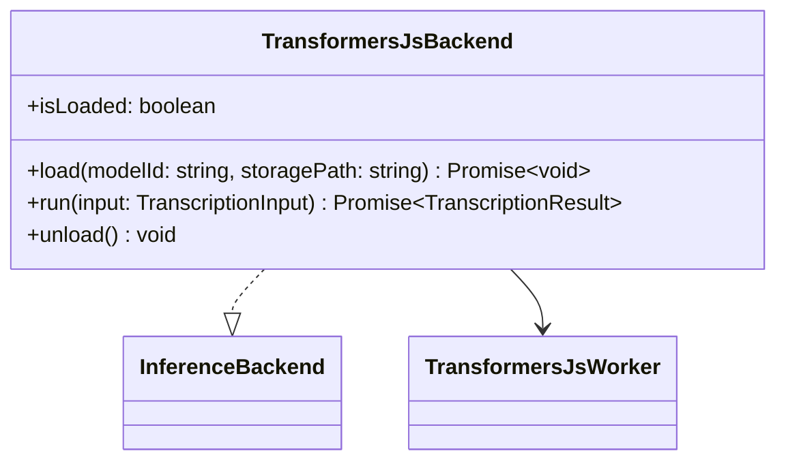

Implements `InferenceBackend<TranscriptionInput, TranscriptionResult>`. Its only responsibility is
the message protocol between the main process and `TransformersJsWorker`. `load()` sends
`{ type: 'loadModel', modelId, storagePath }`; `run()` sends `{ type: 'run', input }`.

`TranscriptionInput` is a moVoice-specific type (`{ audio: Float32Array; language: string | null }`)
that lives in the moVoice layer, not inside the reusable module.

#### `TransformersJsWorker` (implementation detail)

Owns the `worker_threads.Worker` process. Manages the Transformers.js pipeline lifecycle entirely
within the worker thread.

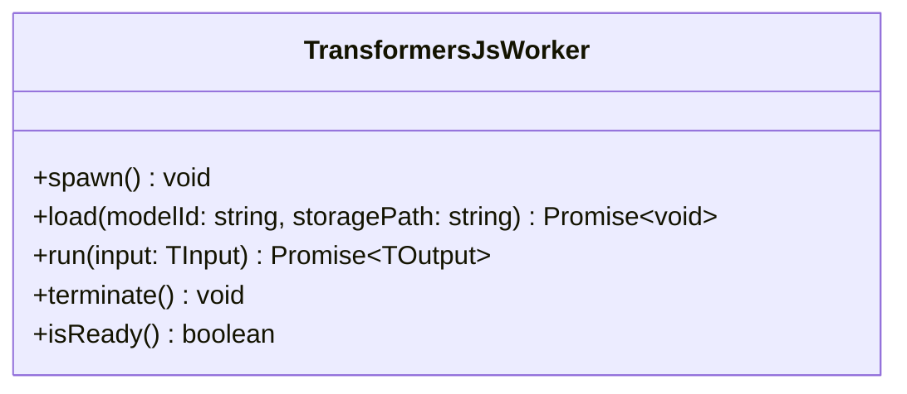

Message protocol:
- `{ type: 'loadModel', modelId, storagePath }` → `{ type: 'modelLoaded' }` / `{ type: 'error', message }`
- `{ type: 'run', input }` → `{ type: 'result', output }` / `{ type: 'error', message }`

`run()` and `load()` are internally serialised via a promise chain: if an inference is running, a
`loadModel` request is queued and executed after it completes (§2.13). The worker name
`TransformersJsWorker` reflects the runtime it wraps, not any domain task — the same worker
infrastructure applies to any Transformers.js model regardless of modality.

### 4.5 System Integration

#### `ShortcutManager`

Registers and manages the global keyboard shortcut. Currently implements toggle mode only — PTT and
combined modes are out of scope. Delegates the actual shortcut firing to `RecordingSessionController`.

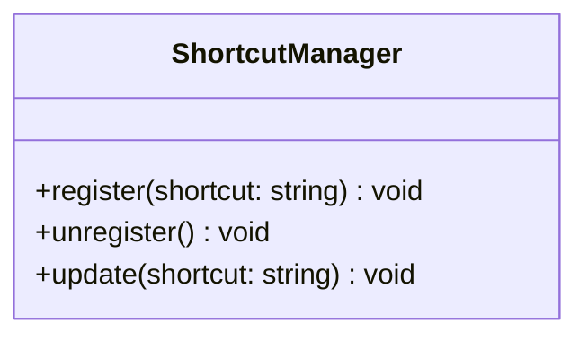

In **toggle mode**: registers one MōBrowser `globalShortcut`; on fire, calls `controller.start()` if
idle, `controller.stop()` if recording.

#### `PasteCoordinator`

Encapsulates the two-step paste operation: write to clipboard, then activate the target app and
simulate Cmd+V. Handles the three failure cases from §4.2–4.5.

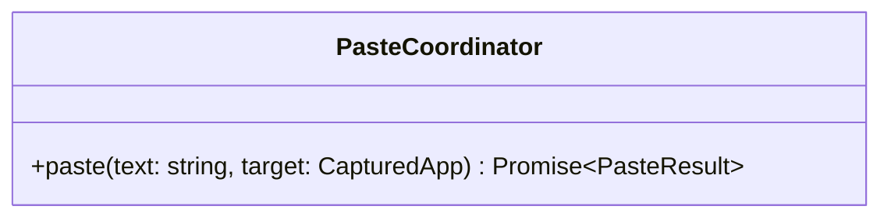

Always writes to clipboard first — the text is not lost even if activation fails. After writing,
checks:
1. Is `target.bundleId` equal to moVoice's own bundle ID? → return `{ success: false, reason:
   'selfTarget' }`.
2. Is Accessibility permission granted? → if not, return `{ success: false, reason:
   'accessibilityDenied' }`.
3. Call `native.paste.ActivateAndPaste(target)`. If the app is gone, the native call returns an
   error → `{ success: false, reason: 'appGone' }`.

`PasteCoordinator` uses MōBrowser `clipboard` (the framework API) for writing, not Node.js or any
other mechanism. This is the only clipboard access point in the entire application.

### 4.6 Model Management

#### `ModelSpec` (reusable interface)

```typescript
interface ModelSpec {
  readonly id: string
  readonly label: string
  readonly description: string
  readonly fileSizeBytes: number
}
```

The minimal descriptor that `LocalModelService` requires. Apps extend it with domain-specific
metadata fields.

#### `LocalModelService<TSpec, TInput, TOutput>` (reusable)

The generic facade for local AI model lifecycle management. It owns: catalog enumeration, download
lifecycle, active model selection, storage path persistence, and inference delegation. It has no
knowledge of Transformers.js, Whisper, or any other domain concept — those live in the `TSpec` type
parameter and the injected `InferenceBackend`.

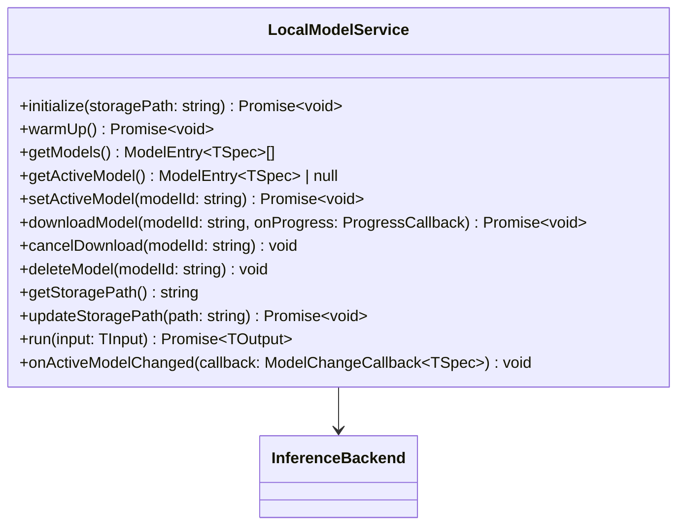

`LocalModelService` is constructed with a `TSpec[]` catalog, an `InferenceBackend<TInput, TOutput>`,
an initial storage path, and a persistence callback `onStoragePathChanged: (path: string) => void`.
It does not import `PreferencesService` — the caller (`Application`) owns the persistence boundary.

`initialize()` scans the storage directory against the catalog to determine which models are present,
and enforces the active-model invariant: if the stored `activeModelId` refers to a model that is no
longer downloaded, fall back to the first downloaded model, or to `null` if none exist.

`warmUp()` spawns `TransformersJsWorker` and loads the active model eagerly. Called as startup step
7 after `initialize()`.

`setActiveModel()` calls `backend.load(modelId, storagePath)` to hot-swap the loaded model.
`deleteModel()` calls `backend.unload()` first if the target model is currently loaded, then removes
the files. Both enforce the invariant that at least one model (or `null`) is always the active state.

`updateStoragePath()` refuses if a download is in progress. Otherwise it updates the path, calls
`onStoragePathChanged`, and re-scans. The active-model invariant is re-enforced after the scan.

`downloadModel()` drives downloads through the `InferenceBackend`'s runtime (for Transformers.js
this is `env` configuration). Partial downloads are cleaned up on failure.

`revealInFinder()` calls `desktop.showPath(modelPath)`. No other class knows model file paths.

`onActiveModelChanged` callbacks fire when `setActiveModel()` or `deleteModel()` changes the active
model. `Application` uses this to keep `PreferencesService` in sync.

#### `WhisperModelCatalog` (moVoice-specific)

Loads and exposes the static `WhisperModelSpec[]` from `resources/models.json`.

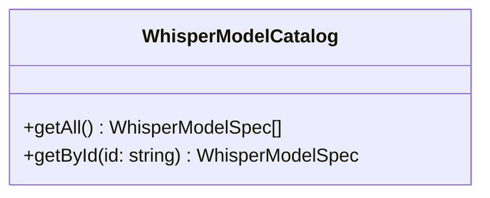

Does not include the synthetic `builtin` entry — that is a separate concept assembled at the
`ModelIpcService` layer when building the combined model list for the UI.

### 4.7 Storage Domain

#### `HistoryStore`

The single source of truth for session history. Reads and writes `history.json` under `<userData>`.
The JSON file is loaded into memory at startup and written synchronously after every mutation.

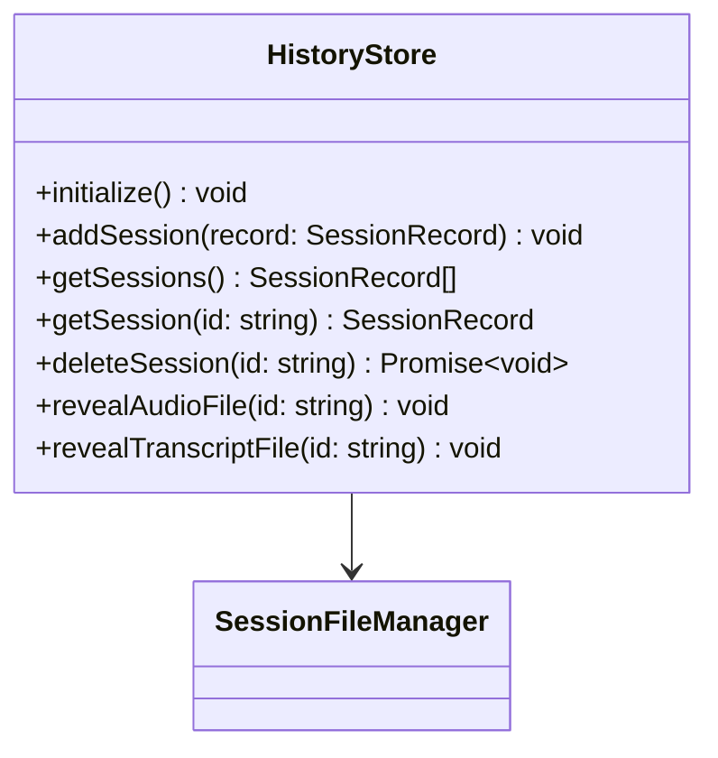

`deleteSession()` calls `SessionFileManager.deleteSessionFiles()` to remove the session directory
from disk, then removes the record from the in-memory array and persists `history.json`.

`revealAudioFile()` and `revealTranscriptFile()` call `desktop.showPath()` via `SessionFileManager`.
If the file does not exist (audio/transcript save was disabled), the method is a no-op.

**Why synchronous JSON writes?** The session history is small (metadata only, no binary). Async
writes for a file this size add complexity without meaningful performance benefit. A crash between
write and flush would corrupt the file; synchronous `fs.writeFileSync` (or equivalent) avoids this
window.

**Alternative: SQLite.** A relational store is more robust for large datasets and supports efficient
querying. Rejected because the dataset here is bounded (at most a few thousand sessions in any
practical usage), and adding a SQLite dependency for a JSON file is over-engineering.

#### `SessionFileManager`

Owns all file path logic, WAV encoding, and file I/O for individual session files.

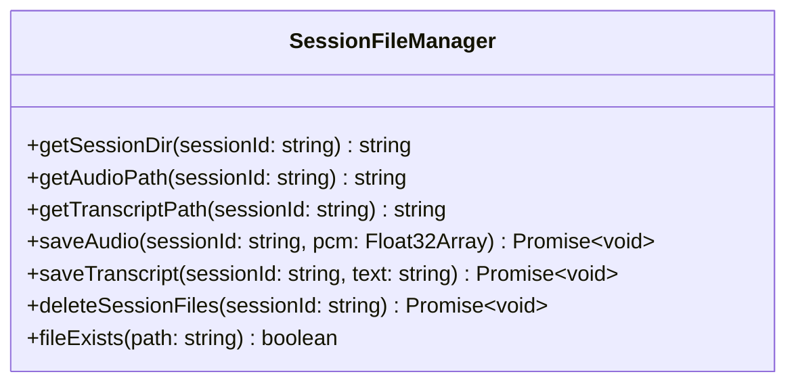

`saveAudio()` writes the WAV container: 44-byte header (RIFF/WAVE/fmt/data chunks, 16 kHz, mono,
32-bit float PCM) followed by the raw `Float32Array`. This is the only WAV encoding site in the
codebase.

### 4.8 Statistics — `StatsCalculator`

A **pure function class** with no state. Takes the session history, applies the formulas from §2.12,
and returns `DashboardStats`. Stateless means it is trivially testable.

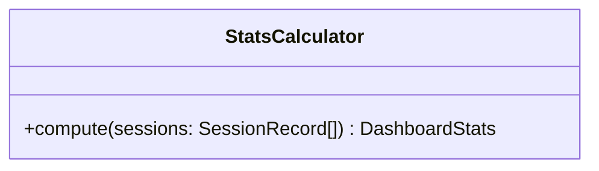

`HistoryStore.getSessions()` is called by `StatsIpcServiceImpl` immediately before calling
`StatsCalculator.compute()`. No caching is needed because the Settings window is not opened
frequently and the computation is O(n) over small n.

### 4.9 Tray and Windows

#### `TrayController`

Creates the MōBrowser `Tray` instance and rebuilds the `Menu` whenever relevant state changes. Holds
references to all services needed to populate the menu items (active model name, shortcut mode,
preferences).

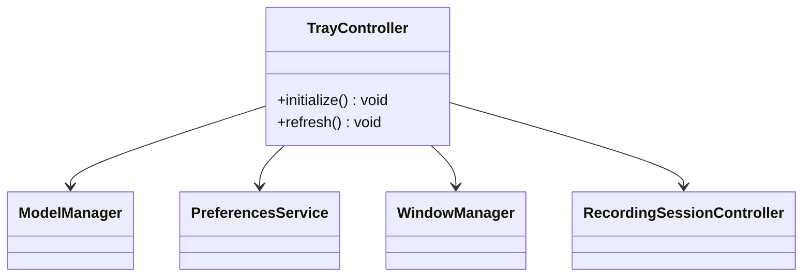

`initialize()` creates the tray and calls `refresh()`. `refresh()` rebuilds the entire `Menu` from
current state. It is called on:
- Startup
- Active model change
- Preference changes (shortcut mode, hide dock icon, launch at login)
- Recording state change (to enable/disable "Start Recording")

The language submenu is **disabled** when the active model is not multilingual
(`ModelEntry.isMultilingual === false`). In that state the menu item is rendered as greyed-out with
no sub-items, because the language preference has no effect on the active backend.

**Why rebuild the entire menu on each refresh rather than mutating individual items?**
MōBrowser's `Menu` API creates an immutable menu object that is passed to `tray.setMenu()`. There is
no documented item-mutation API. Rebuilding is the correct approach.

#### `WindowManager`

Creates and manages the lifecycle of all application windows. Enforces the singleton policy (§2.11).

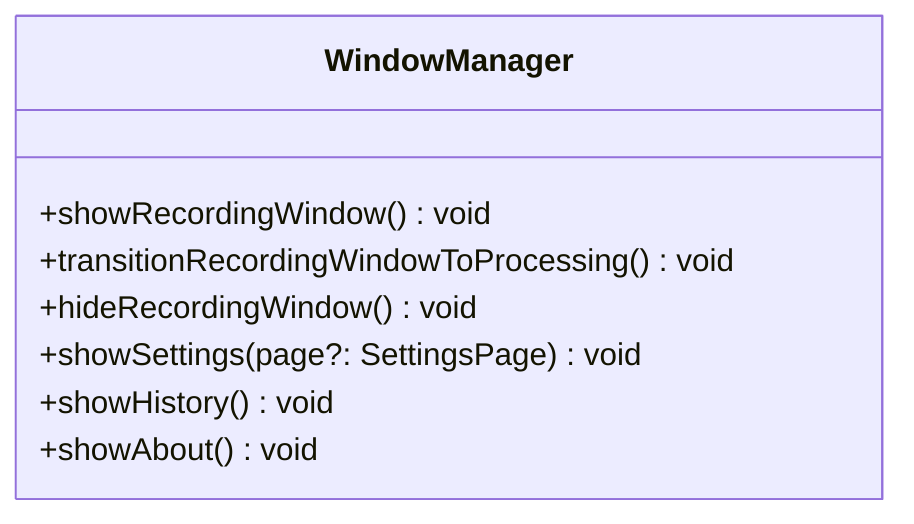

`WindowManager` holds the `BrowserWindow` instances (one per window type). Windows are created
lazily on first show (except the recording window, which is created at startup and kept hidden). The
About window is an exception — it is destroyed on close and recreated on next show.

`transitionRecordingWindowToProcessing()` is called by `RecordingSessionController` when the FSM
transitions to `Processing`. It communicates the transition to the recording window via the polling
mechanism — it sets an internal flag that `RecordingIpcServiceImpl.GetStatus()` will return `state:
'processing'` on the next poll.

**Alternative: `WindowManager` listens to `RecordingSessionController.onStateChange()` directly.**
This is cleaner and is the preferred approach. `WindowManager` registers a state-change callback in
`Application` that calls the appropriate show/hide/transition methods. The controller does not hold
a reference to `WindowManager`. This breaks the coupling.

### 4.10 IPC Services — The Thin Boundary Layer

Six IPC service implementations, each mapped to a proto service definition. Their only job is to
receive a proto message, call the appropriate domain class method, and return a proto response. They
contain no business logic.

```mermaid
classDiagram
  class RecordingIpcService {
    +GetStatus(Empty) RecordingStatusResponse
    +CancelRecording(Empty) Empty
    +SubmitAudio(SubmitAudioRequest) Empty
  }
  class SettingsIpcService {
    +GetPreferences(Empty) PreferencesResponse
    +SetPreference(SetPreferenceRequest) Empty
  }
  class HistoryIpcService {
    +GetSessions(Empty) SessionListResponse
    +DeleteSession(SessionIdRequest) Empty
    +RevealAudioFile(SessionIdRequest) Empty
    +RevealTranscriptFile(SessionIdRequest) Empty
  }
  class ModelIpcService {
    +GetModels(Empty) ModelListResponse
    +DownloadModel(ModelIdRequest) Empty
    +CancelDownload(ModelIdRequest) Empty
    +DeleteModel(ModelIdRequest) Empty
    +SetActiveModel(ModelIdRequest) Empty
    +GetDownloadProgress(ModelIdRequest) DownloadProgressResponse
    +PickStoragePath(Empty) StringResponse
    +SetStoragePath(PathRequest) Empty
  }
  class PermissionsIpcService {
    +GetPermissions(Empty) PermissionsResponse
    +OpenSystemSettings(PermissionTypeRequest) Empty
    +RefreshPermissions(Empty) PermissionsResponse
  }
  class StatsIpcService {
    +GetStats(Empty) DashboardStatsResponse
  }
```

`ModelIpcService.GetDownloadProgress()` is polled by the Settings renderer while a download is in
progress, at 2 fps. The progress value is buffered in `ModelManager` and read synchronously.

`PickStoragePath()` opens a native folder-picker dialog from the main process (the renderer cannot
call dialog APIs directly due to sandbox restrictions) and returns the chosen absolute path, or an
empty string if the user cancelled. `SetStoragePath()` calls `ModelManager.updateStoragePath()`;
if a download is active it returns an error that `ModelsPage` surfaces as an inline message.

`PermissionsIpcService.RefreshPermissions()` calls `native.permissions.GetPermissionsStatus()` — a live
query to the OS — and returns the result. The `Refresh` button in the Permissions UI calls this.

---

## Part V — Native Module Architecture

Audio capture has moved to the renderer process (§2.15). The native module exposes four independent
services, each with a distinct OS boundary and its own `.proto` file. They share a single CMake
target and Cocoa framework linkage — the build is not split, only the service interfaces are.

The split is deliberate: each service is an independently extractable unit that can be packaged and
reused in other MōBrowser applications without pulling in unrelated OS capabilities.

### 5.1 `SystemPermissionsService` — `native.permissions.*`

Queries and acts on macOS system-level permission state.

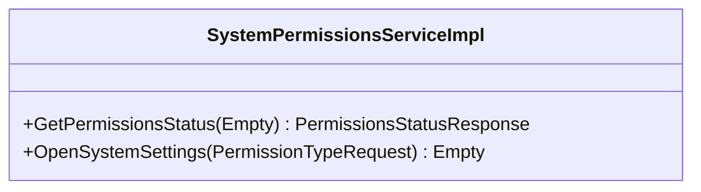

- `GetPermissionsStatus` — queries `AVCaptureDevice.authorizationStatus(for: .audio)`,
  `AXIsProcessTrusted()`, and `SFSpeechRecognizer.authorizationStatus` in one call.
- `OpenSystemSettings` — opens the correct System Settings pane for the given `PermissionType`
  using the `x-apple.systempreferences:` URL scheme.

This service has no dependency on any other native service. It can be extracted as a standalone
module for any MōBrowser app that needs to declare and surface permission requirements.

### 5.2 `PasteService` — `native.paste.*`

Captures the frontmost application and simulates a paste keystroke into it.

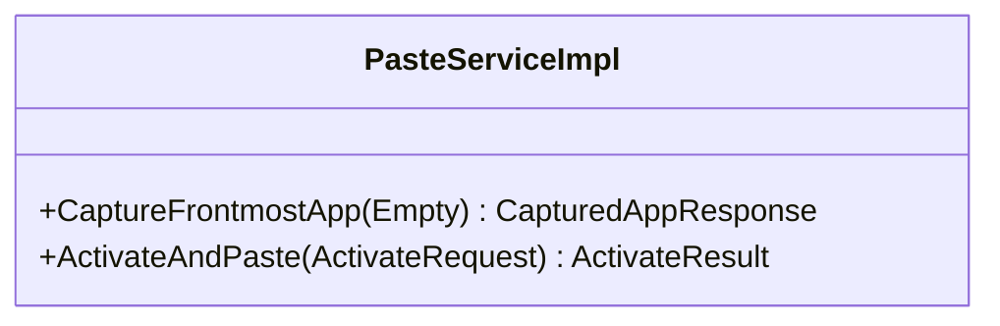

- `CaptureFrontmostApp` — reads `NSWorkspace.shared.frontmostApplication` and returns its bundle ID
  and display name. Called by `RecordingSessionController` at the moment recording starts, before
  the recording window takes focus.
- `ActivateAndPaste` — activates the target app by bundle ID via `NSRunningApplication.activate()`,
  then synthesizes a Cmd+V keypress using `CGEventCreateKeyboardEvent`. Returns an error if the app
  is no longer running.

Requires the macOS **Accessibility** permission (`AXIsProcessTrusted()`). `PasteCoordinator` checks
this via `SystemPermissionsService` before calling `ActivateAndPaste`.

### 5.3 `LoginItemService` — `native.loginItem.*`

Manages the app's login item registration.

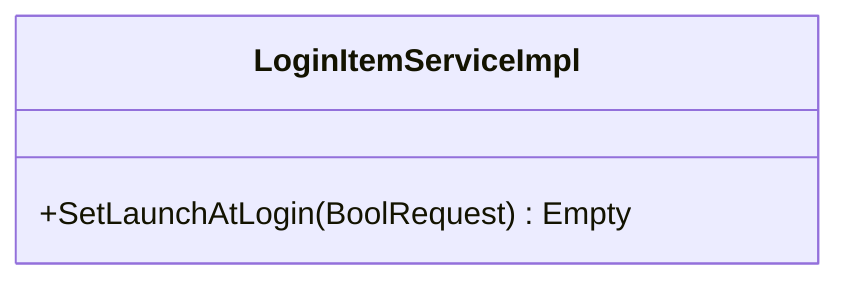

- `SetLaunchAtLogin` — registers or unregisters the app as a login item via `SMAppService`
  (macOS 13+). Called by `Application` whenever the `launchAtLogin` preference changes.

This service is entirely self-contained and reusable by any menu-bar app that needs a launch-at-
login toggle.

### 5.4 `BuiltinSpeechService` — `native.speech.*`

Wraps macOS on-device speech recognition.

```mermaid
classDiagram
  class BuiltinSpeechServiceImpl {
    +RunBuiltinSpeechRecognition(SpeechRequest) SpeechResponse
  }
```

- `RunBuiltinSpeechRecognition` — submits a `Float32Array` (16 kHz, mono) to `SFSpeechRecognizer`
  and returns the transcribed text. The `language` field in `SpeechRequest` is passed as the
  recogniser locale; a null/empty value lets the OS use its default locale.

Permission for speech recognition is checked via `SystemPermissionsService` before this is called.

---

## Part VI — Renderer Architecture

Each window is a separate renderer process running a separate React application. All four share the
generated IPC client from `src/renderer/gen/ipc.ts`.

### 6.1 Recording Window

The recording window is the most time-sensitive renderer. It polls `RecordingService.GetStatus()` at
30 fps.

```mermaid
classDiagram
  class RecordingApp {
    <<component>>
    -state: RecordingState
    -audioContext: AudioContext|null
    -audioStream: MediaStream|null
    -pcmChunks: Float32Array[]
    +render()
  }
  class WaveformVisualizer {
    <<component>>
    +render()
  }
  class ProcessingIndicator {
    <<component>>
    +render()
  }
  class CancelButton {
    <<component>>
    +onCancel: () => void
    +render()
  }
  RecordingApp *-- WaveformVisualizer
  RecordingApp *-- ProcessingIndicator
  RecordingApp *-- CancelButton
```

`RecordingApp` owns two `useEffect` loops:

**State polling loop (30 fps):** Calls `ipc.recording.GetStatus({})`. On each result:
- `idle → recording` transition: calls `getUserMedia({ audio: true })`, sets up `AudioContext`,
  connects `AudioWorkletNode` (accumulates raw PCM chunks into `pcmChunks`) and `AnalyserNode`
  (feeds amplitude to `WaveformVisualizer`).
- `recording → processing` transition: stops the audio track, resamples the accumulated
  `Float32Array` to 16 kHz via `OfflineAudioContext`, then calls
  `ipc.recording.SubmitAudio({ pcm })`. Replaces `WaveformVisualizer` with `ProcessingIndicator`
  immediately — submission is async and the spinner shows while it completes.
- `* → idle` (cancel confirmed or session complete): stops the audio track if still running,
  discards `pcmChunks`. The main process hides the window.

`WaveformVisualizer` and its internal amplitude computation are UI implementation details contained
entirely within the renderer. How the waveform is animated is not an architectural concern.

`CancelButton.onCancel`: immediately stops the audio track and discards `pcmChunks` (responsive
UX), then calls `ipc.recording.CancelRecording({})`. Does **not** call `SubmitAudio`.

### 6.2 Settings Window

```mermaid
classDiagram
  class SettingsApp {
    <<component>>
    -currentPage: SettingsPage
    +render()
  }
  class DashboardPage {
    <<component>>
    -stats: DashboardStats
    +render()
  }
  class GeneralPage {
    <<component>>
    -preferences: Preferences
    +render()
  }
  class ModelsPage {
    <<component>>
    -models: ModelEntry[]
    +render()
  }
  class PermissionsPage {
    <<component>>
    -permissions: PermissionStatus[]
    +render()
  }
  class ShortcutConfigurator {
    <<component>>
    +currentShortcut: string
    +mode: ShortcutMode
    +onChange: ShortcutChangeCallback
    +render()
  }
  class ModelCard {
    <<component>>
    +model: ModelEntry
    +onDownload: () => void
    +onCancelDownload: () => void
    +onDelete: () => void
    +onSetActive: () => void
    +onReveal: () => void
    +render()
  }
  class PermissionRow {
    <<component>>
    +permission: PermissionStatus
    +onOpenSettings: () => void
    +render()
  }
  SettingsApp *-- DashboardPage
  SettingsApp *-- GeneralPage
  SettingsApp *-- ModelsPage
  SettingsApp *-- PermissionsPage
  GeneralPage *-- ShortcutConfigurator
  ModelsPage *-- ModelCard
  PermissionsPage *-- PermissionRow
```

`SettingsApp` fetches all data on mount: preferences, model list, permissions, and stats. Each page
receives its slice as props. Mutations (changing a preference, starting a download) call the
appropriate IPC method and then re-fetch the relevant slice.

**Why refetch rather than optimistic updates?** Because the main process enforces invariants that
the renderer cannot know about — for example, setting a new active model triggers a `loadModel` in
the worker; the new `isActive` flag on model entries only becomes reliable after the main process
confirms. Refetching is safe and the latency is imperceptible.

`ModelsPage` polls `ModelIpcService.GetDownloadProgress()` at 2 fps **only while a download is
active**. The `ModelEntry` returned by `GetModels()` includes a `downloadProgress: number | null`
field. When `downloadProgress` is non-null, the polling interval starts; when it becomes null, the
interval is cleared.

`ModelsPage` also displays the current model storage path (read from `GetModels()` response which
includes the path) and a **"Change…"** button. The button calls `PickStoragePath()` — if a path is
returned, it immediately calls `SetStoragePath()`. On success the model list is re-fetched (the new
path may show different download states). On error (download in progress) an inline warning is
shown.

`ShortcutConfigurator` captures keyboard events on focus to allow the user to define a custom
shortcut. It uses the DOM `keydown` event, not IPC.

The language dropdown in `GeneralPage` renders disabled when `activeModel.isMultilingual` is
`false`. It also offers "Auto-detect" as the first option for multilingual models, corresponding to
`primaryLanguage: 'auto'` in preferences.

### 6.3 History Window

```mermaid
classDiagram
  class HistoryApp {
    <<component>>
    -sessions: SessionRecord[]
    -selectedId: string | null
    +render()
  }
  class SessionList {
    <<component>>
    +sessions: SessionRecord[]
    +selectedId: string | null
    +onSelect: (id: string) => void
    +render()
  }
  class SessionItem {
    <<component>>
    +session: SessionRecord
    +isSelected: boolean
    +onSelect: () => void
    +render()
  }
  class SessionDetail {
    <<component>>
    +session: SessionRecord
    +onDelete: () => void
    +onRevealAudio: () => void
    +onRevealTranscript: () => void
    +render()
  }
  class AudioPlayer {
    <<component>>
    +audioPath: string | null
    +disabled: boolean
    +render()
  }
  HistoryApp *-- SessionList
  HistoryApp *-- SessionDetail
  SessionList *-- SessionItem
  SessionDetail *-- AudioPlayer
```

`AudioPlayer` wraps an HTML `<audio>` element. When `disabled` is true (audio was not saved), the
element is rendered but marked as disabled with a visual indicator. `audioPath` is an absolute path
— the renderer requests it via `HistoryIpcService`, which returns file:// URLs that the HTML audio
element can load.

**Why does the renderer receive a file:// URL rather than streaming audio over IPC?** Because the
HTML `<audio>` element handles buffering, seeking, and all playback state natively. Streaming audio
via Protobuf IPC would require re-implementing a media player from scratch. This is the correct
separation of concerns.

### 6.4 About Window

```mermaid
classDiagram
  class AboutApp {
    <<component>>
    -appInfo: AppInfo
    +render()
  }
```

`AboutApp` fetches `AppService.GetAppInfo()` on mount (returns version, author, app name).
Everything else is static.

---

## Part VII — IPC Contract (Proto Services)

All proto files live in `src/renderer/proto/`. IPC service stubs are generated into `src/main/gen/`
and `src/renderer/gen/`.

### `recording.proto`

```protobuf
service RecordingService {
  rpc GetStatus (Empty) returns (RecordingStatusResponse);
  rpc CancelRecording (Empty) returns (Empty);
  rpc SubmitAudio (SubmitAudioRequest) returns (Empty);
}

message RecordingStatusResponse {
  RecordingState state = 1;
  Error error = 2;
}

message SubmitAudioRequest {
  // Raw Float32 PCM samples, 16 kHz mono, resampled in the renderer.
  // Transmitted as little-endian bytes (4 bytes per sample).
  bytes pcm = 1;
}

enum RecordingState {
  IDLE = 0;
  RECORDING = 1;
  PROCESSING = 2;
}
```

### `settings.proto`

```protobuf
service SettingsService {
  rpc GetPreferences (Empty) returns (PreferencesResponse);
  rpc SetPreference (SetPreferenceRequest) returns (Empty);
}

message SetPreferenceRequest {
  string key = 1;
  string value = 2;    // JSON-encoded value for the given key's type
}
```

Using a `string value` (JSON-encoded) for `SetPreference` rather than a separate RPC per preference
avoids a proliferation of setter methods. The key is validated against the known preference registry
in `SettingsIpcService`.

### `model.proto`

```protobuf
service ModelService {
  rpc GetModels (Empty) returns (ModelListResponse);
  rpc DownloadModel (ModelIdRequest) returns (Empty);
  rpc CancelDownload (ModelIdRequest) returns (Empty);
  rpc DeleteModel (ModelIdRequest) returns (Empty);
  rpc SetActiveModel (ModelIdRequest) returns (Empty);
  rpc GetDownloadProgress (ModelIdRequest) returns (DownloadProgressResponse);
  rpc PickStoragePath (Empty) returns (StringResponse);
  rpc SetStoragePath (PathRequest) returns (Empty);
}

message DownloadProgressResponse {
  float progress = 1;  // 0.0–1.0, or -1 if not downloading
}

message PathRequest {
  string path = 1;
}
```

### `history.proto`

```protobuf
service HistoryService {
  rpc GetSessions (Empty) returns (SessionListResponse);
  rpc DeleteSession (SessionIdRequest) returns (Empty);
  rpc RevealAudioFile (SessionIdRequest) returns (Empty);
  rpc RevealTranscriptFile (SessionIdRequest) returns (Empty);
  rpc GetAudioUrl (SessionIdRequest) returns (StringResponse);
}
```

`GetAudioUrl` returns the `file://` URL to the audio file. This decouples the renderer from file
path construction.

### `permissions.proto`

```protobuf
service PermissionsService {
  rpc GetPermissions (Empty) returns (PermissionsResponse);
  rpc OpenSystemSettings (PermissionTypeRequest) returns (Empty);
  rpc RefreshPermissions (Empty) returns (PermissionsResponse);
}

enum PermissionType {
  MICROPHONE = 0;
  SPEECH_RECOGNITION = 1;
  ACCESSIBILITY = 2;
}
```

### `stats.proto`

```protobuf
service StatsService {
  rpc GetStats (Empty) returns (DashboardStatsResponse);
}
```

### `app.proto`

```protobuf
service AppService {
  rpc GetAppInfo (Empty) returns (AppInfoResponse);
}
```

### Shared `error.proto`

```protobuf
message Error {
  string code = 1;    // machine-readable, e.g. "MIC_PERMISSION_DENIED"
  string message = 2; // human-readable, shown in notifications
}
```

---

## Part VIII — Data Schemas

These TypeScript interfaces are shared types. Because the renderer cannot import from the main
process, they are defined in `src/shared/types.ts` and imported by both sides.

```typescript
// ─── Recording ───────────────────────────────────────────────────────────────

type RecordingState = 'idle' | 'recording' | 'processing'

// PTT and combined modes are out of scope; toggle only for now.
type ShortcutMode = 'toggle'

interface CapturedApp {
  readonly bundleId: string
  readonly name: string
}

type PasteResult =
  | { readonly success: true }
  | { readonly success: false; readonly reason: 'appGone' | 'accessibilityDenied' | 'selfTarget' }

// ─── Reusable local model module ─────────────────────────────────────────────

// Base descriptor required by LocalModelService. Apps extend this.
interface ModelSpec {
  readonly id: string
  readonly label: string
  readonly description: string
  readonly fileSizeBytes: number
}

// Generic inference backend — the only place any AI runtime is referenced.
interface InferenceBackend<TInput, TOutput> {
  load(modelId: string, storagePath: string): Promise<void>
  run(input: TInput): Promise<TOutput>
  unload(): void
  readonly isLoaded: boolean
}

// ─── Models (moVoice-specific) ────────────────────────────────────────────────

// moVoice-specific input type for Whisper inference.
interface TranscriptionInput {
  readonly audio: Float32Array
  readonly language: string | null  // null = auto-detect
}

// WhisperModelSpec extends ModelSpec with Whisper/HuggingFace-specific metadata.
interface WhisperModelSpec extends ModelSpec {
  readonly huggingFaceRepo: string
  readonly speedScore: number      // 1.0–5.0
  readonly accuracyScore: number   // 1.0–5.0
  readonly isMultilingual: boolean // false for English-only variants
}

// Kept for backwards-compatibility in shared types; aliases WhisperModelSpec.
type ModelDefinition = WhisperModelSpec & { readonly isBuiltin: false }

interface BuiltinModelDefinition {
  readonly id: 'builtin'
  readonly label: 'Built-in macOS Recognition'
  readonly description: string
  readonly isMultilingual: true  // SFSpeechRecognizer is locale-aware
  readonly isBuiltin: true
}

type AnyModelDefinition = ModelDefinition | BuiltinModelDefinition

// ModelEntry is the moVoice-specific view model assembled by ModelIpcService.
// LocalModelService internally uses ModelEntry<WhisperModelSpec> for real models only.
interface ModelEntry extends AnyModelDefinition {
  readonly isDownloaded: boolean   // always true for builtin
  readonly isActive: boolean
  readonly downloadProgress: number | null // null = not currently downloading
}

// ─── Transcription ───────────────────────────────────────────────────────────

interface TranscriptionResult {
  readonly text: string
  // The language the model detected or used. null for English-only models and
  // for built-in recognition (which does not report a detected language code).
  readonly detectedLanguage: string | null
}

// ─── Session History ─────────────────────────────────────────────────────────

interface SessionRecord {
  readonly id: string              // UUID v4
  readonly timestamp: number       // Unix ms, recording start time
  readonly transcriptionText: string
  readonly audioPath: string | null
  readonly transcriptPath: string | null
  readonly modelId: string
  readonly language: string | null // preference at recording start; null = 'auto'
  readonly detectedLanguage: string | null // reported by model; null if not available
  readonly audioDurationSeconds: number
  readonly transcriptionDurationMs: number
  readonly targetAppName: string
  readonly audioSaved: boolean
  readonly transcriptSaved: boolean
}

// ─── Statistics ───────────────────────────────────────────────────────────────

interface DashboardStats {
  readonly totalSessions: number
  readonly totalWords: number
  readonly totalTimeSavedSeconds: number
  readonly wordsPerMinute: number
  readonly keystrokesSaved: number
}

// ─── Preferences ─────────────────────────────────────────────────────────────

interface Preferences {
  readonly shortcutKey: string      // e.g. "F5"
  readonly shortcutMode: ShortcutMode
  readonly hideDockIcon: boolean
  readonly launchAtLogin: boolean
  readonly dontSaveTranscripts: boolean
  readonly dontSaveAudio: boolean
  readonly activeModelId: string
  // BCP-47 code (e.g. "en", "uk") or the sentinel "auto".
  // "auto" is only meaningful for multilingual models; for single-language
  // models this field is ignored entirely.
  readonly primaryLanguage: string
  // Absolute path to the directory where model files are stored.
  // Not hardcoded — set to <userData>/models on first run by Application.initialize()
  // and persisted. Changing this does not move existing model files.
  readonly modelStoragePath: string
}

// Defaults (used by PreferencesService when a key is absent)
const PREFERENCE_DEFAULTS: Preferences = {
  shortcutKey: 'F5',
  shortcutMode: 'toggle',
  hideDockIcon: false,
  launchAtLogin: false,
  dontSaveTranscripts: false,
  dontSaveAudio: false,
  activeModelId: 'builtin',
  primaryLanguage: 'auto',  // auto-detect by default; user can override
  modelStoragePath: '',     // empty = not yet initialised; set on first run
}

type PreferenceKey = keyof Preferences

// ─── Permissions ─────────────────────────────────────────────────────────────

type PermissionType = 'microphone' | 'speechRecognition' | 'accessibility'
type PermissionGrantStatus = 'granted' | 'denied' | 'notDetermined'

interface PermissionStatus {
  readonly type: PermissionType
  readonly status: PermissionGrantStatus
  readonly description: string
}

// ─── App Info ────────────────────────────────────────────────────────────────

interface AppInfo {
  readonly name: string
  readonly version: string
  readonly author: string
}
```

---

## Part IX — Full Class Dependency Graph

```
Application (composition root)
│
├── PreferencesService
│     └── MōBrowser prefs (external)
│
├── TrayController
│     ├── ModelManager (read: active model name)
│     ├── PreferencesService (read: preferences)
│     ├── WindowManager (open windows)
│     └── RecordingSessionController (onStateChange listener)
│
├── WindowManager
│     └── (holds BrowserWindow instances)
│
├── ShortcutManager
│     ├── MōBrowser globalShortcut (external)
│     ├── native.system.MonitorKeyUp (PTT mode)
│     └── RecordingSessionController (start/stop calls)
│
├── RecordingSessionController
│     ├── native.system.CaptureFrontmostApp
│     ├── TranscriptionRouter (transcribe)
│     ├── PasteCoordinator (paste)
│     ├── HistoryStore (addSession)
│     └── PreferencesService (read: save flags, language)
│
├── TranscriptionRouter
│     ├── ModelManager (read: active model)
│     ├── WhisperTranscriptionService
│     └── BuiltinSpeechTranscriptionService
│
├── WhisperTranscriptionService
│     └── TranscriptionWorker
│
├── BuiltinSpeechTranscriptionService
│     └── native.system.RunBuiltinSpeechRecognition
│
├── TranscriptionWorker
│     └── worker_threads.Worker (Transformers.js)
│
├── PasteCoordinator
│     ├── MōBrowser clipboard (external)
│     └── native.system.ActivateAndPaste
│
├── ModelManager
│     ├── ModelCatalog
│     └── (callback → TranscriptionRouter.notifyModelChanged)
│
├── ModelCatalog
│     └── resources/models.json
│
├── HistoryStore
│     └── SessionFileManager
│
├── SessionFileManager
│     └── Node.js fs (WAV write, file operations)
│
├── StatsCalculator (stateless)
│
└── IPC Services (each holds a reference to its domain class)
      ├── RecordingIpcService → RecordingSessionController
      ├── SettingsIpcService  → PreferencesService
      ├── HistoryIpcService   → HistoryStore
      ├── ModelIpcService     → ModelManager
      ├── PermissionsIpcService → native.system.GetPermissionsStatus
      └── StatsIpcService     → HistoryStore + StatsCalculator
```

---

## Part X — Key Decisions Summary

| Decision | Choice Made | Primary Alternative Rejected | Reason |
|---|---|---|---|
| Main→renderer communication | Polling (renderer-initiated RPC at 30 fps) | Streaming proto RPC / `executeJavaScript` push | MōBrowser IPC is documented as unary RPC only; polling is straightforward and adequate |
| Stats persistence | Derived from history records at read time | Separate stats accumulator persisted to `prefs` | Eliminates a second write path; history is the ground truth |
| Audio file format | WAV | MP3/AAC | No codec dependency; lossless; browser-playable without plugin |
| Model catalog | Bundled JSON | Remote endpoint | Offline-first; no network dependency; update-on-release is acceptable |
| Window lifecycle | Singleton, hide-not-destroy | Destroy and re-create | Avoids React re-initialisation; preserves UI state |
| Error propagation | Typed `Error` field in every proto response | Centralised error service / unhandled exceptions | Each domain handles its own errors; no single point of failure |
| Preferences writes | Write-through (`persist()` on every `set`) | Batch persist at shutdown | Eliminates crash-induced preference loss |
| Transcription backend selection | `TranscriptionRouter` queries `ModelManager` at call time | Reconfigure `RecordingSessionController` on model change | Simpler; no synchronisation required |
| PTT key-up detection | `CGEventTap` in native module | `globalShortcut` key-up event | `globalShortcut` does not expose key-up; OS-level tap is the only reliable mechanism |
| Session IDs | UUID v4 | Timestamp | Collision-free; no user-identifiable information in filename |
| History persistence | JSON file | SQLite | Dataset is bounded and small; SQLite adds a dependency without benefit |
| Stats computation formula | 40 WPM typing baseline, 6 chars/word | Variable baseline from settings | Simplest meaningful implementation; a user-configurable baseline is a future feature |
| Audio capture location | Renderer (Web Audio API) | Native C++ `AVAudioEngine` | Chromium provides `getUserMedia`, `AudioWorklet`, `AnalyserNode`, resampling, and device change handling for free; eliminates the entire native audio service |
| Audio input device | System default; no picker | Per-device selection | Product decision: reduces UI surface area; Chromium's `getUserMedia` handles device routing and route changes natively |
| Language in `transcribe()` | `string \| null`; `null` = auto-detect | Separate `detectLanguage()` call | Single call site; the model does detection internally; no extra round-trip to the worker |
